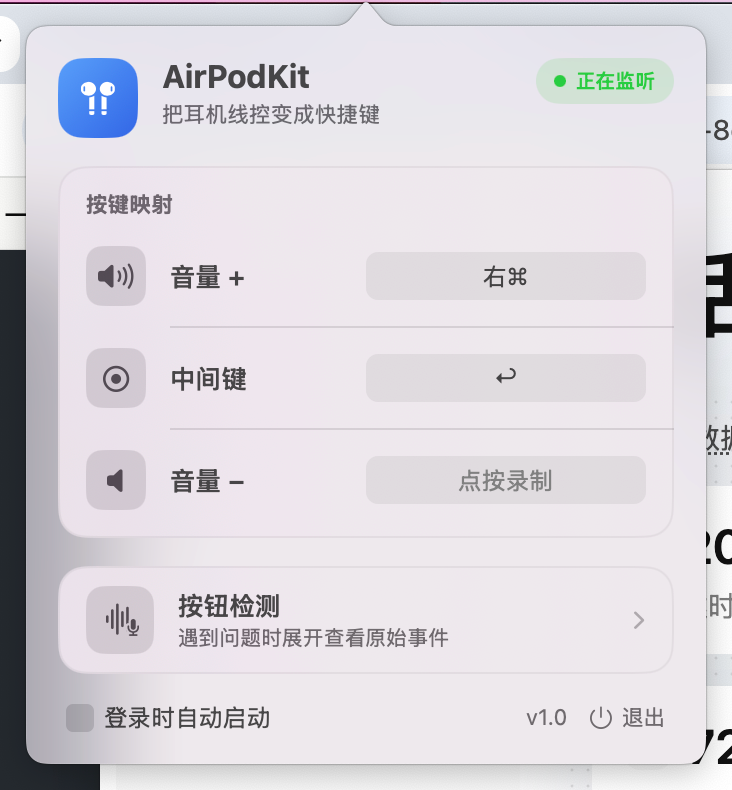

# AirPodKit

把 Apple 有线耳机的线控按键，变成语音输入快捷键和 Mac 快捷键。

AirPodKit 是一个常驻 macOS 菜单栏的小工具。它不负责录音、语音识别或文本生成，而是把有线 EarPods 及兼容耳机的音量加、中间键、音量减，映射成你指定的键盘按键或快捷键。

如果你使用 Typeless、闪电说、Wispr Flow、Superwhisper 等语音输入软件，需要按一个快捷键开始/结束输入，或者还要按 `Return` 提交内容，AirPodKit 可以把这些操作搬到耳机线控上，减少手摸键盘的次数。

## 界面预览



## 它解决什么问题

很多语音输入软件的基本流程是：

1. 把光标放进输入框；
2. 按快捷键开始录音或听写；
3. 说完后再按一次快捷键结束；
4. 必要时再按 `Return` 发送内容。

AirPodKit 可以把这个流程改成：

1. 点击一次输入框；
2. 按耳机中间键开始输入；
3. 再按一次中间键结束输入；
4. 按耳机音量减键发送内容。

具体行为取决于语音输入软件的快捷键设置，以及当前应用是否使用 `Return` 作为发送键。

## 适用的语音输入软件

AirPodKit 目前面向以下语音输入软件的快捷键控制：

- Typeless
- 闪电说
- Wispr Flow
- Superwhisper

也可以配合其他支持全局键盘快捷键的语音输入软件使用。AirPodKit 不需要安装这些软件的插件，也不负责调用它们的语音识别功能。

## 一个典型设置

假设语音输入软件已经被设置为使用 `Fn` 启动/结束听写，可以这样配置：

| 耳机按键 | AirPodKit 映射 | 用途 |
| --- | --- | --- |
| 中间键 | `Fn` | 开始/结束语音输入 |
| 音量减 | `Return` | 发送或提交输入内容 |
| 音量加 | `Esc` 或其他快捷键 | 取消、清空或执行其他操作 |

配置完成后，AirPodKit 只向当前正在使用的 macOS 软件发送这些键盘事件，不会打开“音乐”软件，也不会直接操作某个指定的语音输入软件。

## 按键行为

| 耳机线控按键 | 可以设置为 | 没有设置时 |
| --- | --- | --- |
| 音量加 | 任意键或快捷键 | 系统音量加 |
| 中间键 | 任意键或快捷键 | 系统播放/暂停 |
| 音量减 | 任意键或快捷键 | 系统音量减 |

设置映射后，AirPodKit 会拦截对应的系统媒体操作，只发送你设置的按键。中间键设置为快捷键后，不会再按系统默认行为启动 Music。

## 功能

- 三个线控按键可以分别设置，互不影响。
- 支持单个普通按键，例如 `Return`、`F1`、方向键。
- 支持组合快捷键，例如 `⌘⇧S`、`⌥→`。
- 支持单独的 `Fn`、`⌘`、`⌥`、`⌃` 或 `⇧` 修饰键。
- 支持 `Fn` 与其他修饰键、普通按键组合。
- 左右修饰键可以区分，例如左 `⌘` 和右 `⌘` 可以设置成不同动作。
- 配置会自动保存到本机。
- 可以设置为登录 macOS 后自动启动。
- 只显示在菜单栏，不占用 Dock 图标或独立主窗口。

## 安装

### 从 GitHub Release 安装

下载地址：[https://github.com/wdwxw/airpodKit/releases](https://github.com/wdwxw/airpodKit/releases)

在 Releases 页面下载 `AirPodKit-1.0.dmg`，打开后将 `AirPodKit.app` 拖入“应用程序”文件夹，再从“应用程序”中启动。

当前 DMG 使用本地开发证书签名，尚未使用 Apple Developer ID 签名和公证。首次启动如果被 macOS 拦截，请在“系统设置 → 隐私与安全性”中允许打开，或右键点击应用后选择“打开”。

### 从源码构建

### 环境要求

- macOS 13 Ventura 或更高版本；
- Xcode 或可用的 macOS 编译环境；
- Homebrew，用于安装 XcodeGen；
- Apple 有线 EarPods、带线控的兼容耳机，或通过 3.5mm、Lightning、USB-C 连接的兼容线控设备。

无线 AirPods 使用另一套蓝牙控制协议，目前不在支持范围内。

### 从 GitHub 安装

```bash
brew install xcodegen
git clone https://github.com/wdwxw/airpodKit.git
cd airpodKit
./build.sh --run
```

构建完成后，应用位于：

```text
build/AirPodKit.app
```

以后重新构建并启动，仍然执行：

```bash
./build.sh --run
```

## 首次启动：授予系统权限

AirPodKit 需要以下两个 macOS 权限才能捕获并替换耳机按键：

1. 打开 **系统设置 → 隐私与安全性 → 辅助功能**，允许 AirPodKit；
2. 打开 **系统设置 → 隐私与安全性 → 输入监控**，允许 AirPodKit；
3. 回到 AirPodKit，等待两个权限都显示为已授权。

首次启动时，AirPodKit 会显示授权提示，并提供打开对应系统设置页面的按钮。如果授权后按键仍然没有反应，退出并重新打开 AirPodKit。

## 使用方法

### 1. 打开菜单栏设置

启动 AirPodKit 后，点击菜单栏中的 AirPodKit 图标。

### 2. 先在语音输入软件中设置快捷键

在 Typeless、闪电说、Wispr Flow 或其他语音输入软件的设置中，把开始/结束输入的快捷键设置为 AirPodKit 支持的键。`Fn`、`⌘`、`⌥`、`⌃`、`⇧` 及其组合都可以使用。

### 3. 录制耳机按键映射

在“按键映射”区域找到要修改的按键：

1. 点击右侧的“点按录制”；
2. 按下想要设置的键或快捷键；
3. 等待录制完成，设置会自动保存；
4. 如果录制过程中想取消，按 `Esc`。

例如，把中间键录制为语音输入软件的开始/结束快捷键，把音量减录制为 `Return`。

### 4. 使用耳机按键

完成设置后，先点击目标输入框，再直接按对应的耳机线控按键。快捷键会发送给当前正在使用的 macOS 软件。

### 5. 设置登录启动

在菜单栏设置中打开“开机时启动”。之后登录 macOS 后，AirPodKit 会自动运行，无需每次手动打开。

## 当前限制

- AirPodKit 当前只处理单次按键，不支持中间键双击、三击或长按。
- 因此更适合“按一下开始、再按一下结束”的切换模式，不适合“按住开始、松开结束”的 Push-to-Talk 模式。
- AirPodKit 不负责语音识别、文本润色、自动粘贴或发送；它只负责捕获耳机按键并发送键盘事件。
- `Return` 是否会发送内容，取决于当前应用的输入框行为。
- 没有设置映射的按键会保持 macOS 原本的行为。
- 当前版本是开发版，未经过 Apple Developer ID 签名和公证。首次运行时，macOS 可能需要你在“隐私与安全性”中确认允许运行。

## 排查问题

### 按键完全没有反应

确认以下事项：

- AirPodKit 正在运行，并且菜单栏中能看到图标；
- “辅助功能”和“输入监控”两个权限都已开启；
- 耳机是有线线控设备，而不是无线 AirPods；
- 已经在对应按键右侧录制并保存了快捷键；
- 语音输入软件中的快捷键与 AirPodKit 录制的快捷键完全一致；
- 如果需要发送内容，确认当前应用确实使用 `Return` 提交。

确认后仍无效，可以退出 AirPodKit，再执行一次：

```bash
./build.sh --run
```

## 反馈与问题

欢迎在 GitHub 提交问题或功能建议：

[提交 Issue](https://github.com/wdwxw/airpodKit/issues)
